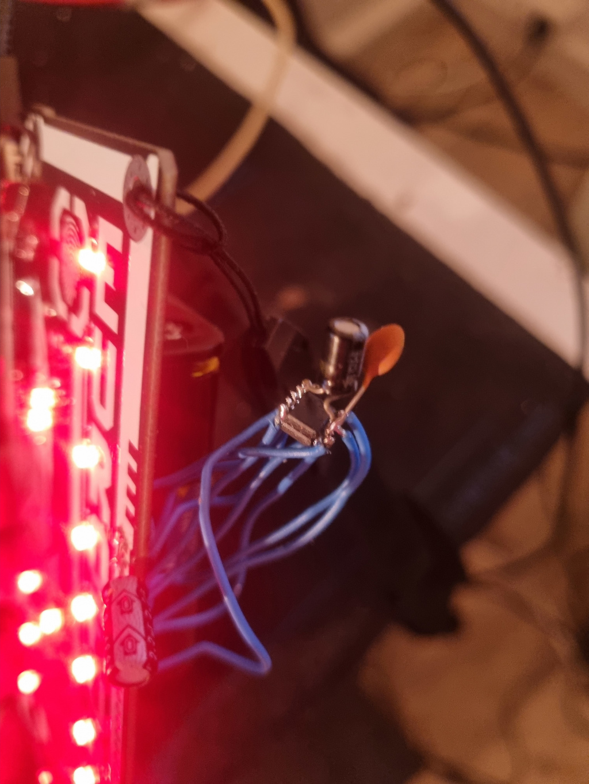

# Linux on Eurofurence 28 Cyber Badge

This is my attempt at doing something crauy with the EF badge, in this case, booting Linux by emulating a RISC-V procesor.

This project was made possible by [mini-rv32ima](https://github.com/cnlohr/mini-rv32ima).

The total boot time is as little as 1m25s after RAM initialization, which translates to anywhere from 1m45s to 2m15s after power-on. I‘ve extended rv32-ima by emulated GPIO drivers to make the badge LEDs accessible from within Linux userspace, as well as a RTC (just because I can).

## Memory Configuration

The only required additional hardware are two PSRAM ICs, either APS6404 or LY68L6400. These can be wired up to GPIOs on the ESP32 as you please, just remember to update the pin definitions in `lib/SDRAM/SDRAM.h`

Although support for quad mode on the PSRAM is supported, you may save two GPIO pins by using regular SPI mode. Several defines at the top of `lib/SDRAM.cpp` need to be edited to match your config.

If you are using SPI mode, undef `USE_QUAD` and `USE_QUAD_READ`. You may be able to boost the SPI clock from 60MHz to 80MHz in this case. If you encounter problems at this speed, try defining `QUESTIONABLE_SPI_FIXES`.
If using quad mode, define `USE_QUAD` and `USE_QUAD_READ`. Do not change the clock to above 60MHz. Should you still encounter instability, undef only `USE_QUAD_READ`. This will return to using SPI for read operations, while still using quad mode for write operations.

**IMPORTANT NOTE:** having decoupling caps on the PSRAM ICs is **required!** At least 2µF of bulk capacitance and 100nF of filter capacitance. Increase bulk capacitance if still encountering instability.

You can bodge wire the PSRAMs though. If you follow this route, solder two bulk caps for maximum stability: one at the ICs and one at the breakout header on the PCB.

Other than that, you are good to go. By default, the badge will download a RAM image from my fileserver, which should let you test that things are working. To customize the image, clone the rv32-ima subrepo and run `make everything` in it to build a custom image. After the emulator has booted, kill it and run `make compressed` in `mini-rv32ima/mini-rv32ima` to obtain the file `rv32_c.bin`, which is the compressed RAM image. How you get it into the PSRAM is up to you. I recommended hosting it somewhere where the ESP can download it.

Edit the file `mini-rv32ima/hello_linux/hello_linux.c` to change the program that is run after boot. It includes an example of how to use the LEDs. If you wish to run another program or drop to a bash prompt, edit `mini-rv32ima/configs/rootfsoverlay/etc/inittab`.

## Build Configuration

Several build flags are available for configuring the way the emulator works. The most important are `ONLINE_LINUX_IMAGE` and `ONLINE_LINUX`. If `ONLINE_LINUX_IMAGE` is set, the RAM image will be downloaded from my server or any other URL you specify in the code. If unset, it will fall back to loading the image from a 25Q32 SPI-Flash, which you must first wire up to the badge and configure the pinout in `lib/SPIFLASH/SPIFLASH.h`. Wire HOLD and WP to 3.3V.

`ONLINE_LINUX` enables or disables online features of the emulator, currently only the RTC. If set, the real time will be fetched from an NTP server on boot. Otherwise, a fixed time and date will be used.

`TELNET_SHELL` needs to be defined to enable the esp32 to generate a WiFi Access Point and Telnet server to remote access the bash prompt of the booted Linux OS. Note that, if used together with `ONLINE_LINUX_IMAGE`, it’ll disconnect from WiFi after downloading the RAM image. `TELNET_SHELL` implies that `ONLINE_LINUX` is NOT defined past the NTP lookup.
